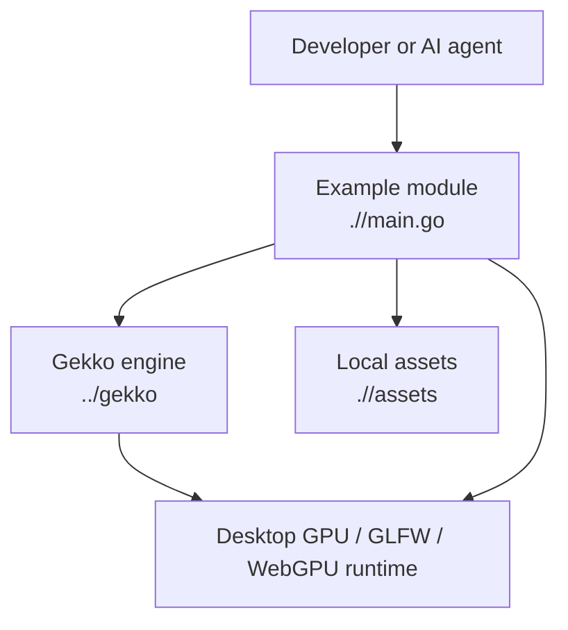

# Architecture — Gekko3D Examples

## System Overview

This workspace is a collection of small desktop demo applications built on top of the sibling `../gekko` engine module. Each example is intentionally thin: it assembles engine modules, registers demo-specific ECS systems/resources, and launches a local windowed scene to demonstrate one feature area such as entity grouping, water effects, particles, collision events, UI, or asset loading. The examples are linked together locally through `../go.work`, but each example also has its own `go.mod` so it can be run in isolation with a `replace` directive back to `../../gekko`.

## Architecture Diagram

## Core Components

### Example Modules

- **Purpose:** Standalone runnable demos with focused behavior.
- **Technology:** Go `package main`
- **Source:** `./<example>/main.go`, `./<example>/go.mod`
- **Key Behaviors:** Configure app state, register engine/demo modules, load local assets, print usage instructions, launch the render loop.

### Sibling Engine Module

- **Purpose:** Provides ECS, app lifecycle, rendering, input, physics, water, UI, and asset systems used by the examples.
- **Technology:** Go module `github.com/gekko3d/gekko`
- **Source:** `../gekko/`
- **Key Behaviors:** Supplies reusable modules like `TimeModule`, `AssetServerModule`, `VoxelRtModule`, `PhysicsModule`, and domain-specific components/systems.

### Workspace Glue

- **Purpose:** Keeps multiple example modules and the engine working together locally.
- **Technology:** Go workspace
- **Source:** `../go.work`
- **Key Behaviors:** Declares the active local modules and shared WebGPU replace directive used for development.

## Primary Data / Control Flow

1. Developer runs an example from its directory.
2. The example's `main.go` constructs a `NewApp()`.
3. Engine modules are registered through `UseModules(...)`.
4. The demo module installs systems/resources for the scene.
5. Assets are loaded from the example's `assets/` directory or resolved relative to the repo root.
6. The engine enters its staged update/render loop and drives the desktop scene.

## Security Model

- **Authentication:** None; these are local desktop examples.
- **Authorization:** None.
- **Secrets:** No secret storage should exist in this workspace.
- **Filesystem access:** Limited to local example assets and normal Go build/runtime behavior.

## Scalability & Resilience

- **Scaling:** Not applicable; demos run as local desktop applications.
- **Resilience focus:** Keep startup deterministic, avoid brittle asset paths, and prefer small regression tests for scene math or state transitions where possible.
- **Failure mode to watch:** Many failures are runtime-only and depend on local GPU/windowing support rather than pure unit-test coverage.

## Key Design Decisions

| ADR | Date | Summary |
|---|---|---|
| None yet | — | Architectural decisions for this workspace have not been recorded in `.ai/adr/` yet. |
