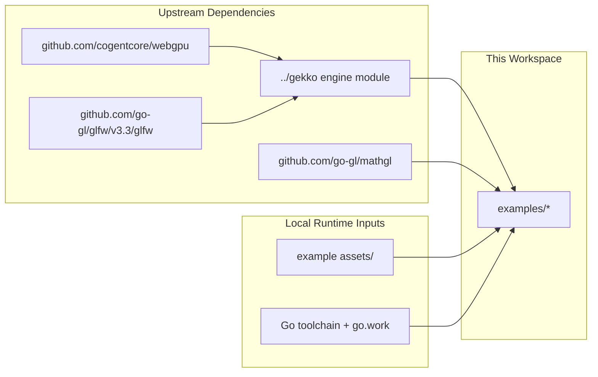

# Dependencies — Gekko3D Examples

## Dependency Map

## Upstream Dependencies (We Consume)

| Service / System | Type | Protocol | Purpose | Owner | Failure Impact |
|---|---|---|---|---|---|
| `../gekko` | Internal local module | Go module import | Core engine APIs and runtime systems | Gekko maintainers | Examples fail to build or run |
| Go toolchain | Local toolchain | CLI | Build, test, and run examples | Local developer environment | No local validation possible |
| Desktop GPU/windowing stack | Local runtime | OS/graphics APIs | Window creation and rendering | Local developer environment | Visual demos cannot be exercised |

## Downstream Dependencies (Consume Us)

| Service / System | Type | Protocol | What They Consume | Owner |
|---|---|---|---|---|
| Engine contributors | Internal users | Source code / local runs | Example patterns and manual demos | Gekko contributors |
| Future docs/readme updates | Internal users | Markdown/source | Runnable usage examples | Repo maintainers |

## Infrastructure Dependencies

| Resource | Type | Details | Provisioned By |
|---|---|---|---|
| `../go.work` | Workspace config | Binds the active local modules together | Repository |
| Example `assets/` folders | Local files | Textures, vox models, shaders used by demos | Repository |
| WebGPU replace directive | Go module override | Uses `github.com/ddevidchenko/webgpu` during local development | Repository |

## Critical Libraries

| Library | Version | Purpose | Notes |
|---|---|---|---|
| `github.com/gekko3d/gekko` | local replace | Engine APIs used by all examples | Sourced from `../../gekko` |
| `github.com/cogentcore/webgpu` | `v0.23.0` | Rendering backend dependency | Replaced in the workspace |
| `github.com/go-gl/glfw/v3.3/glfw` | pseudo-version | Windowing/input backend | Usually indirect through engine |
| `github.com/go-gl/mathgl` | `v1.2.0` | Math types and vector helpers | Imported directly by many examples |
| `github.com/google/uuid` | `v1.6.0` | Engine/runtime support | Usually indirect in examples |

## Shared / Internal Libraries

| Library | Version | Purpose | Repo |
|---|---|---|---|
| `../gekko` | local workspace | Core ECS/game engine functionality | sibling module in this repo tree |

## API Contracts

There are no network APIs in this workspace. The stable contracts here are code-level:

- engine module APIs imported from `github.com/gekko3d/gekko`
- per-example asset layouts under `assets/`
- local module boundaries defined by each example's `go.mod`

## Environment Configuration

| Config Key | Description | Where Managed | Differs Per Env? |
|---|---|---|---|
| `GOWORK` | Often set to `off` for isolated example runs | Shell command line | Yes |
| `GOCACHE` | Optional cache override used in README/examples | Shell command line | Yes |

## Notes

- Module paths are not fully uniform across examples; some use `github.com/gekko3d/examples/...` while others use `github.com/gekko3d/gekko/examples/...`. Treat that as an existing repo characteristic unless the task is explicitly to normalize it.
