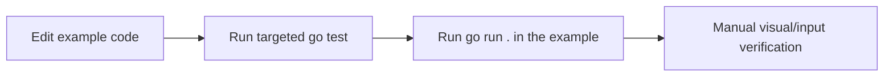

# Deployment — Gekko3D Examples

## Overview

- **Target:** Local developer workstation
- **Artifact Type:** Runnable Go example binaries
- **CI/CD:** None at the examples-workspace level
- **IaC:** None
- **Strategy:** Build or run the affected example module locally

## Execution Flow



## Validation Commands

```bash
# Automated validation inside one example
cd examples/<example>
env GOWORK=off GOCACHE=/tmp/gekko3d-gocache go test ./...

# Manual smoke run
cd examples/<example>
env GOWORK=off GOCACHE=/tmp/gekko3d-gocache go run .
```

If the change depends on engine behavior, also run targeted tests from `../gekko`.

## Environment Notes

| Environment | Trigger | Approval | Notes |
|---|---|---|---|
| Local dev shell | Manual | Not applicable | Normal path for example work |
| GPU/windowing runtime | Manual | Not applicable | Required for real smoke verification |

## Packaging

- Example folders may build a local binary named after the folder.
- Those binaries are disposable local artifacts and should not be committed.

## Secrets & Configuration

- No production secrets or remote deployment credentials should exist here.
- Runtime configuration is mostly code-based plus optional shell env vars such as `GOWORK` and `GOCACHE`.

## Rollback

```bash
# Revert or edit the local change set
git diff
git restore --staged <path>
```

Do not use destructive git cleanup unless the user explicitly requests it.

## Health Checks & Monitoring

There is no deployed service health model. Validation is local:

- the example builds
- targeted tests pass
- the demo launches and behaves as expected
- assets load from the expected paths

## Post-Change Checklist

- [ ] The touched example still builds
- [ ] Targeted `go test` passed or the limitation is documented
- [ ] A manual smoke run was done if behavior is visual/interactive
- [ ] No compiled binary or editor artifact was added to version control
